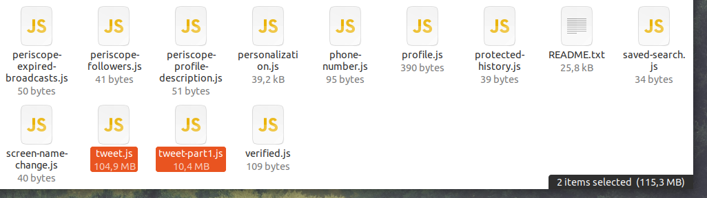

# twitter-archive-parser (en)

When you request your twitter data, Twitter will generate a zip file with everything you posted on the site, your tweets, photos and videos.

After you download and unzip the file, you will have a few `.js` files, your tweets are stored in the file named `tweet.js` and depending of your tweet count you can have other files named `tweet-partX.js`.

The `tweet.js` file contains an array where each item is a tweet as a multline json object, the [`parser.py`](parser.py) script reads this file as an argument and output the items in the array in a json file with a tweet per line so it can be ingested into elasticsearch using a logstash pipeline.