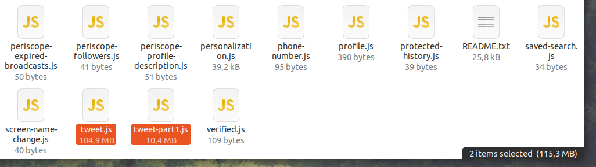

# twitter-archive-parser (pt_br)

Quando você solicita seus dados no twitter, O Twitter irá gerar um arquivo zip com tudo que você publicou no site, seus tweets, fotos e vídeos.

Após realizar o download e descompactar o arquivo, você verá alguns arquivos `.js`, seus tweets ficam armazeados em um arquivo chamado `tweet.js` e dependendo da quantidade de tweets, você poderá ter outros arquivos chamados `tweet-partX.js`

O arquivo `tweet.js` contêm um array onde cada item é um tweet no formato de um objeto json multi-linha, o script [`parser.py`](parser.py) lê esse arquivo como um parâmetro e salva os itens presentes no array em um arquivo json de saída onde cada linha corresponde a um tweet, dessa forma ele pode ser indexado no elasticsearch utilizando um pipeline do logstash.